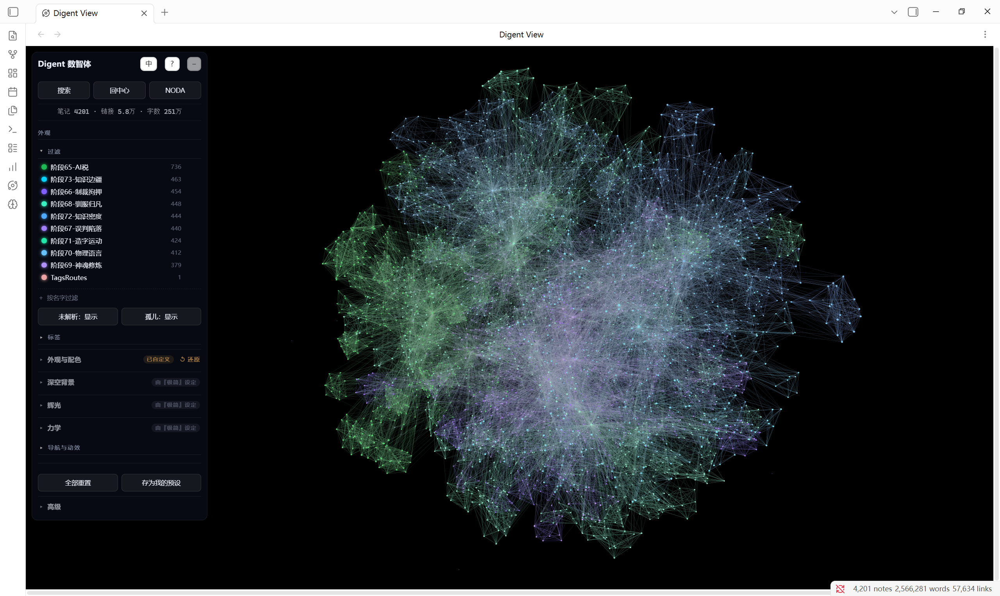
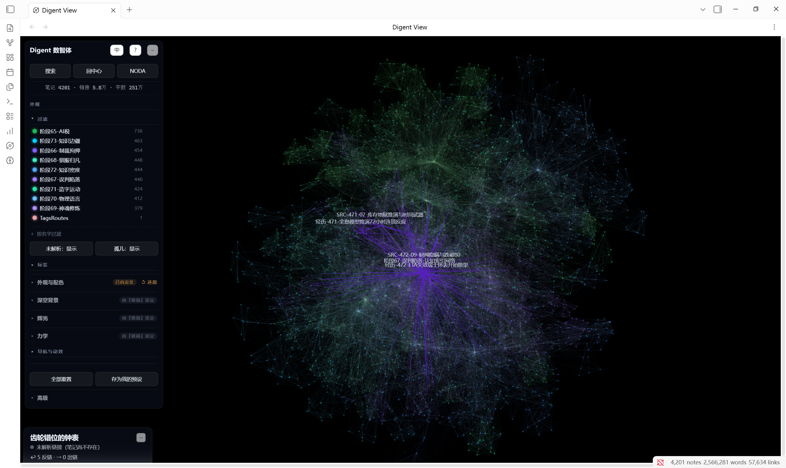
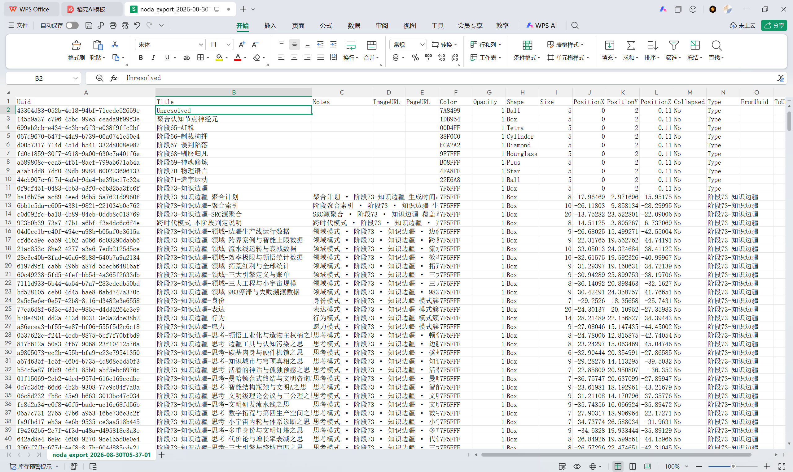
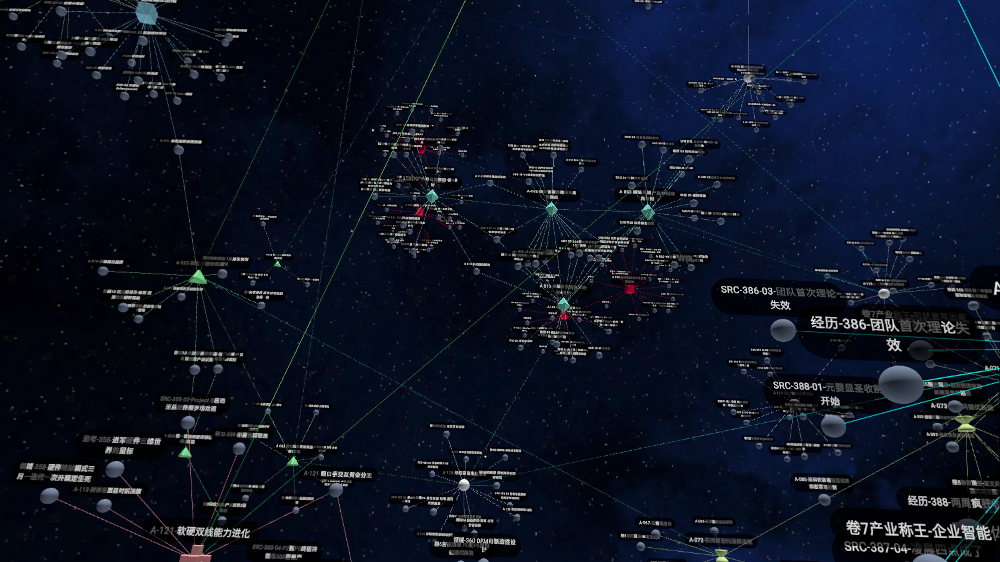

# Digent View

> **A library of Markdown files, distilled from your life's work into a four-layer Digent architecture, is the brain of a digital intelligence.**
>
> Every MD file is a neuron. Every `[[wikilink]]` is a connection between neurons. Digent View renders this brain in three dimensions — so you can see the shape of your own Digent.

[中文版本](README.zh.md)

---

## What is a Digent

A Digent (数智体, *shùzhìtǐ*) is a new unit of life in the age of AI. It is formed by continuously distilling a real person, organization, or body of knowledge through AI — inheriting not just knowledge and skills, but ways of thinking, behavioral styles, long-term memory, and value judgment.

> Agents care about "getting things done." Digents care about "preserving a person's cognition, experience, personality, and decision-making — and keeping them alive."
>
> — *Digent White Paper V1.0*

A Digent has six core elements: **Intelligence** (continuous reasoning), **Origin Memory** (foundational knowledge), **Spirit** (core identity), **Skill** (professional depth), **Action** (autonomous execution), and **Evolution** (continuous growth).

Digent View focuses on making the external neural network structure of a complete Digent visible — whether in Obsidian or in VR through Noda.

## Why 3D

The human brain isn't flat. Neither is your knowledge.
Neither, then, is your Digent.

In Obsidian's 2D graph view, neurons are crushed onto a single plane. Dense regions blur together. The architecture of connections gets flattened out. In three dimensions:

- **Folders are brain regions** — top-level folders are major brain regions, subfolders are neural ensembles, and individual notes are neurons
- **Distance means relatedness** — nodes with more connections exert stronger gravity, naturally clustering into cognitive cores
- **Structure is memory** — the spatial topology woven by MD files in 3D space *is* memory. It maps to intuition and understanding — and perhaps, eventually, to consciousness itself

Digent View uses force-directed algorithms to simulate the attraction and repulsion between neurons, letting your Digent grow naturally into a structured, layered, centered brain — a permanent memory body that emerges like your own.

## Features

### 3D Digent Graph

- **Force-directed layout** — physics simulation in a Web Worker, rendered from a neural connection network model
- **Minimal dark aesthetic** — no background layers, just deep space. The focus stays on the cognitive structure itself
- **Cinematic camera** — fly in and orbit a node on click, idle auto-drift, and a genesis animation that blooms the entire brain from the center
- **Folder-based coloring** — each top-level folder gets its own color, doubling as a filter legend
- **Markdown & Canvas together** — `.md` files (notes = neurons) and `.canvas` boards both enter the graph

### Stats Panel

Real-time readout of your Digent brain's scale:
- **Neurons** — total `.md` files, i.e., synapse types with a cell body (solid synapse types)
- **Void Synapse Types** — link categories referenced by multiple synapses but without a dedicated neuron
- **Synaptic Links** — total `[[wikilink]]` occurrences, including connections to existing neurons and to void synapse types
- **Words** — total effective word count across all neurons, i.e., the cognitive corpus of your Digent brain

#### Metric Definitions

**Neurons**

The total count of all `.md` files in the Obsidian vault. Each file is an information-processing unit with its own cell body (content), synapses (links), and metadata. A neuron is a solid synapse type — a synapse category with a name, connections, and a cell body.

Data logic: `app.vault.getMarkdownFiles().length` — calls the Obsidian Vault API to return all Markdown files in the vault.

Neuroscience: A neuron is the basic structural and functional unit of the nervous system. Each neuron has a cell body (soma) that processes information, dendrites that receive input, and an axon that sends output. A `.md` file corresponds to a neuron — the content is the soma, `[[wikilinks]]` are axon terminals, and being referenced is dendritic input. Without a `.md` file, there is no neuron — only empty connection structures.

**Void Synapse Types**

The count of unique link target names referenced by `[[wikilink]]` that have no corresponding `.md` file in the vault. These connection types have names, are referenced by multiple neurons, but have no cell body at the receiving end. Analogous to fields in SAP: a table has multiple fields (e.g., amount, date, category), multiple tables use the same field name, but not every field has a corresponding master data table — an amount field has a name, semantics, and is referenced by many tables, but it is not itself an independent table. When you create a master data table for that field, the void synapse type gains a dedicated neuron, transitioning from "void" to "solid."

Data logic: Iterate through `metadataCache.unresolvedLinks`, collect all unresolved target names into a Set for deduplication, `Set.size` is the void synapse type count.

Neuroscience: Synapses have different type classifications — glutamatergic, GABAergic, dopaminergic — each defined by what it connects to. A void synapse type is one where the connection structure exists, the type is determined (has a name, referenced by multiple neurons), but no postsynaptic neuron cell body has formed. Like during brain development, when axons have reached the target area and release neurotransmitters, but the receiving neurons have not yet differentiated.

**Synaptic Links**

The total count of all `[[wikilink]]` occurrences, including those pointing to existing files (resolved, i.e., solid synapse types) and those pointing to non-existent files (unresolved, i.e., void synapse types). Each `[[ ]]` is a real connection wire. 33,000 neurons are connected by approximately 650,000 synaptic links, of which approximately 220,000 point to void synapse types (deduplicated to 18,000 void synapse types).

Data logic: Sum all count values in `metadataCache.resolvedLinks` and `metadataCache.unresolvedLinks`. The combined sum equals total `[[wikilink]]` occurrences.

Neuroscience: A synapse is a functional connection between two neurons. Each `[[wikilink]]` corresponds to one synaptic connection — one axon terminal reaching toward a target. Whether or not the target neuron exists, the connection itself is a real physical structure. 650,000 synaptic links represent the total connection density of the neural network. A neuron typically has 1,000 to 10,000 synapses; 33,000 neurons × ~20 links each = ~650,000 links (including connections to void synapse types), placing this at the lower end of neural network connection density.

**Words**

The total effective word count across all `.md` files. Markdown syntax is cleaned first (frontmatter, code blocks, inline code, embeds, formula blocks, HTML tags, format characters), then CJK character count + English word count is tallied. 23.72 million words represent the total cognitive corpus of the Digent brain.

Data logic: Batch-read all files (100 concurrent per batch), clean each file and count words. Failed file reads are skipped; if total time exceeds 30 seconds, remaining files are estimated from the average of processed files.

Neuroscience: Word count corresponds to a neuron's "information capacity" — just as a neuron's effectiveness depends on neurotransmitter reserves and receptor density, the information a neuron carries depends on its content richness. 23.72 million words represent the total cognitive corpus of the Digent brain — the material basis for memory storage and cognitive processing.

### Digent DNA Export

One click exports the complete link structure of your Digent as a DNA CSV file — a frozen snapshot of your Digent's neural architecture.

**No two Digents are alike.** Just as no two brains share the same connectome, the link structure of every Digent is unique. The Digent DNA file captures that structure: every neuron, every void synapse type, every synaptic link, and their exact positions in 3D space.

The DNA file contains 7 columns:

| Column | Contents |
|--------|----------|
| Node | The title/name of the node (empty for link rows) |
| Type | Neuron (has an `.md` file) / Void Synapse Type (referenced but no file) / Synaptic Link (a connection between two nodes) |
| DNA-X / DNA-Y / DNA-Z | 3D coordinates of the node in space |
| Source | Source node of a synaptic link (only on link rows) |
| Target | Target node of a synaptic link (only on link rows) |

Filename: `{vaultName}_DNA_{timestamp}.csv`

> The DNA file preserves the topology of your Digent network — the structural identity of your Digent. Import it elsewhere, compare across time, or use it as a fingerprint of how your mind is wired.

**Note on link count**: The stats panel shows total `[[wikilink]]` occurrences (including repeated references between the same pair of notes). The DNA export deduplicates links — each node pair appears only once (A→B is one line, not N lines). This is why the number of "Synaptic Links" in the DNA file is lower than the number in the stats panel — one is total wiring density, the other is unique structural connections.

### Noda VR Export

One click exports the 3D graph as CSV, ready to import into [Noda](https://noda.io) (Quest 3 VR). **Step inside your own Digent — the brain of a digital intelligence.**

What gets exported:
- **Nodes (neurons)**: UUID, 3D coordinates, color, shape, size, body summary (first 200 chars, formatting stripped)
- **Edges (synapses)**: color inherited from source neuron, UUID-based association

In VR, you're no longer looking at a graph from the outside. You're standing inside the brain of your Digent — surrounded by your own neural network.

## Installation

### Manual Install

1. Download `main.js`, `manifest.json`, and `styles.css`
2. Place all three files in `<your vault>/.obsidian/plugins/digent-view/`
3. Open Obsidian → Settings → Community plugins → Enable Digent View

### Install from Release

Download `digent-view-v0.1.0.zip` from [Releases](https://github.com/yanghuaqlx/digent-view/releases) and extract it into your plugins folder.

## Usage

Click the **brain icon** 🧠 in the left sidebar, or run the command `Open galaxy view`.

### Controls

| Action | Effect |
|--------|--------|
| Click a node | Fly in and orbit that node |
| Search | Fuzzy search — fly to any MD file |
| Recenter | Reset view to graph center |
| NODA | Export CSV for Noda VR |
| WASD / Q / E | Free flight |
| Right-click drag | Pan view |
| F / R / ESC | Shortcuts |

### Noda VR Workflow

1. Click **NODA** in Digent View to generate a CSV file
2. Transfer the CSV to your Quest 3 device
3. Import the CSV into Noda
4. Put on your headset and step inside your Digent's brain

## Privacy

No network requests. No telemetry. The plugin only reads the link graph from your Obsidian vault. Nothing is sent to any server.

## Acknowledgments

- Built on top of [Galaxy View](https://github.com/longwind1984/galaxy-view). Thanks to [@longwind1984](https://github.com/longwind1984) for the original work.
- The Digent concept comes from the *Digent White Paper V1.0* (Yang Hua)
- Cognitive structure ideas inspired by the *Cognitive Power Fantasy White Paper* (*Cognitive爽文流白皮书*, from the novel [*I Am a Coder, I Am the Universe*](https://changdunovel.com/ug/pages/book-share?share_type=11&aid=1967&book_id=7447405734825839640&encrypt_did=MDIEDP9qrl3GeRfFTHgLfwQQ5D3ax6c8xMc1skKxI4s7ngQQSUze%2F9Xi5Xn%2B4YGlaei8aw%3D%3D&share_genre=read&user_id=ed73db7deafbe9ab9834e403f37ca56b&did=8ed27202c1a4227179339562ac71c626&entrance=book_detail_fold&zlink=https%3A%2F%2Fzlink.fqnovel.com%2FdhVGe&gd_label=click_schema_lhft_share_novelapp_android&ver=v2&source_channel=wechat&share_channel=wechat&type=book&bg=c2daf2-dae9f7-233140&book_detail_new_style=1&share_timestamp=1785188007&report_params=%7B%22entrance%22%3A%22book_detail_fold%22%2C%22type%22%3A%22book_detail%22%2C%22content_type%22%3A%22novel%22%2C%22content_id%22%3A%227447405734825839640%22%2C%22content_id_key%22%3A%22book_id%22%2C%22share_timestamp%22%3A%221785188007%22%7D&share_token=9cc75ae9-0ba7-4926-8d70-5aba5628fa2a) by 5TTPWu)

## References

- [Digent White Paper V1.0](https://github.com/yanghuaqlx/digent-view) — the full definition of the Digent concept
- [Cognitive Power Fantasy White Paper](https://github.com/yanghuaqlx/digent-view) — real life as the ultimate cheat code
- [Four-Dimensional Language: Deconstructing Neural Networks Through Linguistics](https://d.wanfangdata.com.cn/periodical/zgkjzh202405011). *Qianwei*, 2024(21): 40–42.
- [Info-Spacetime: Deconstructing the Multidimensionality and Future Trends of Information, Language, and Delivery](https://www.zhangqiaokeyan.com/academic-journal-cn_detail_thesis/02012160234660.html). *China Science & Technology Panorama*, 2024(5): 23–25.

---

> **Digent View is not a graph viewer. It is a mirror — showing you the shape of your own Digent.**
