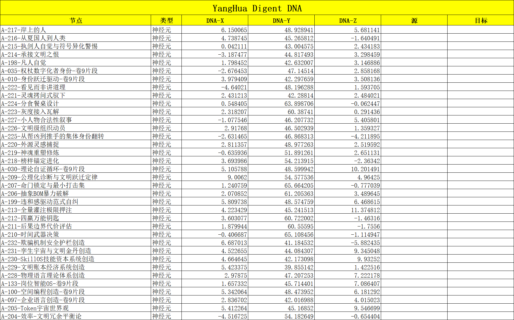

# Digent View

> **基于"认知爽文"作品等材料，按照Digent构建的4层架构蒸馏出来的MD文件库，就是一个数智体的大脑。**
>
> 每一份MD文件就是一个神经元，每一条 `[[wikilink]]` 是一条神经元之间的链接。Digent View 将这座大脑以三维形态呈现，让你看见自己的Digent结构。

[English version](README.md)

---

## 什么是数智体（Digent）

数智体（Digent），是 AI 时代的新生命单元。它由真实的人、组织或知识体系，通过 AI 持续蒸馏形成——不仅继承知识与技能，还继承思维方式、行为风格、长期记忆和价值判断。

> Agent 关注的是"把事情做完"，数智体关注的是"把一个人的认知、经验、人格、决策方式沉淀下来，并持续存在"。
>
> ——《数智体白皮书 V1.0》

数智体的六个核心要素：**智**（持续推理）、**忆**（本源记忆）、**魂**（精神内核）、**技**（专业能力）、**行**（自主执行）、**长**（持续成长）。

Digent View 关注的是在obsidian或者VR 的Noda里，具象化的呈现出一颗完整的Digent外在的神经元网络结构。

## 为什么是 3D

人脑不是平面的。你的知识体系也不是。
因此你的Digent依然不是。

在obsidian的二维图谱里，神经元之间被压扁在同一平面上，密集区域糊成一团，神经元链接结构被抹平。而在三维空间里：

- **文件夹即脑区**——顶层文件夹是脑区，子文件夹是神经簇（神经元集合 ensemble），单篇笔记是神经元
- **距离即关联**——链接越多的节点引力越强，自然聚集成认知核心区
- **结构即记忆**——MD文件在三维空间中构建起来的空间网状拓扑结构，为记忆，映射出对知识的直觉与理解，甚至最终涌现出意识

Digent View 用力导向算法模拟神经元之间的吸引与排斥，让你的Digent自然生长成一座有结构、有层次、有核心的大脑形态，涌现出类似你自己的永久记忆体。

## 核心功能

### 3D Digent图谱

- **力导向布局**——Web Worker 力学模拟，基于神经元链接网络模型的渲染
- **极简暗色画风**——无背景层，纯净深空，专注认知结构本身的呈现
- **电影感镜头**——点节点飞入环绕、闲置自动漂移、开场从中心绽放整颗大脑的构建动画
- **文件夹配色**——每个顶层文件夹对应一种颜色，同时充当过滤图例
- **Markdown 与 Canvas 同图**——`.md`=笔记=神经元，和 `.canvas` 画布都进入图谱

### 统计面板

实时显示你 Digent 数智体大脑的规模：
- **神经元**——你的 `.md` 文件总数，即有细胞体的实突触类
- **空突触类**——被多条突触链接引用、但还没有专属神经元的连接类别
- **突触链接**——所有 `[[wikilink]]` 出现的总次数，包括指向已有神经元的连线和指向空突触类的连线
- **字数**——所有神经元正文的有效词数总量，即 Digent 数智体大脑的认知语料总量

#### 指标定义

**神经元**

Obsidian 库中所有 `.md` 文件的总数。每个文件是一个有实体内容的信息处理单元，拥有独立的细胞体（正文）、突触（链接）和元数据。一个神经元就是一个实突触类——有名字、有连接、有细胞体的突触类别。

取数逻辑：`app.vault.getMarkdownFiles().length`，直接调用 Obsidian Vault API 返回当前库中所有 Markdown 文件数量。

神经学意义：神经元是神经系统的基本结构和功能单元。每个神经元有细胞体（soma）处理信息，有树突接收输入，有轴突发送输出。一篇 `.md` 文件对应一个神经元——正文是细胞体，`[[wikilink]]` 是轴突末端，被引用是树突接收输入。没有 `.md` 文件就没有神经元，只有空的连接结构。

**空突触类**

被 `[[wikilink]]` 引用但库中不存在对应 `.md` 文件的唯一目标名称数。这些连接类型有名字、被多个神经元引用，但接收端没有细胞体。类似于 SAP 中的字段：一张表有多个字段（如金额、日期、类别），多个表会用到同名字段，但并非每个字段都有对应的主数据表——金额字段有名字、有语义、被多张表引用，但它本身不是一张独立的表。当你为这个字段创建主数据表时，空突触类就获得了专属神经元，从"空"变为"实"。

取数逻辑：遍历 `metadataCache.unresolvedLinks`，收集所有未解析目标名到 Set 中去重，`Set.size` 即为空突触类数量。

神经学意义：突触有不同的类型分类——谷氨酸能突触、GABA 能突触、多巴胺能突触——每类由它连接的"什么"来定义。空突触类是指：连接结构已存在、类型已确定（有名字、被多个神经元引用），但突触后膜没有形成对应的神经元细胞体。就像大脑发育过程中，轴突已长到目标区域并释放递质，但接收神经元尚未分化出来。

**突触链接**

所有 `[[wikilink]]` 出现的总次数，包括指向已存在文件的（已解析，即实突触类）和指向不存在文件的（未解析，即空突触类）。每一条 `[[ ]]` 都是一根真实的连线。3.3 万个神经元通过约 65 万条突触链接相连，其中约 22 万条指向空突触类（去重后为 1.8 万个空突触类）。

取数逻辑：对 `metadataCache.resolvedLinks` 和 `metadataCache.unresolvedLinks` 中所有 count 值求和。两者之和 = 所有 `[[wikilink]]` 出现次数。

神经学意义：突触是两个神经元之间的功能性连接点。每一条 `[[wikilink]]` 对应一条突触连线——一个轴突末端伸向一个目标。不管目标神经元是否存在，这根连线本身是真实的物理结构。65 万条突触链接代表整个神经网络的总连接密度。一个神经元平均有 1,000 到 10,000 条突触，3.3 万个神经元 × 平均约 20 条 = 约 65 万条（含指向空突触类的连线），处于神经网络连接密度的下限区间。

**字数**

所有 `.md` 文件正文的有效词数总量。先清洗 Markdown 语法（frontmatter、代码块、行内代码、嵌入引用、公式块、HTML 标签、格式字符），再统计 CJK 字符数 + 英文单词数。2,372 万字代表整个 Digent 数智体大脑的认知语料总量。

取数逻辑：分批读取所有文件（每批 100 个并发），逐文件清洗后统计词数。单文件读取失败跳过，总耗时超 30 秒则按已处理文件平均值估算全部。

神经学意义：字数对应神经元的"信息容量"——就像神经元的 effectiveness 取决于神经递质储备量和受体密度，一个神经元携带的信息量取决于其内容丰富度。2,372 万字代表整个 Digent 数智体大脑的认知语料总量，是记忆存储和认知处理的物质基础。

### Digent DNA 导出

一键导出整个Digent的链接结构，生成 DNA CSV 文件——你的数智体神经架构的一张定格快照。

**世界上没有两个一模一样的Digent。** 就像没有两个人脑拥有完全相同的连接组（connectome），每个 Obsidian 库的链接结构都是独一无二的。Digent DNA 文件记录了这种结构：每一个神经元、每一个空突触类、每一条突触链接，以及它们在三维空间中的精确位置。

DNA 文件包含 7 列：

| 列 | 内容 |
|---|------|
| 节点 | 节点名称（连线行为空） |
| 类型 | `神经元`（有 .md 文件）/ `空突触类`（被引用但无文件）/ `突触链接`（两个节点之间的连接） |
| DNA-X / DNA-Y / DNA-Z | 节点在空间中的 3D 坐标 |
| 源 | 突触链接的源节点（仅连线行有值） |
| 目标 | 突触链接的目标节点（仅连线行有值） |

文件名格式：`{库名}_DNA_{时间戳}.csv`

> DNA 文件保留了你知识网络的拓扑结构——这是你数智体的结构身份。可以导入到其他地方、跨时间对比、或作为你心智连接方式的指纹。

**关于链接数不一致的说明**：统计面板显示的是所有 `[[wikilink]]` 出现的总次数（同一对笔记之间的多次引用都算）。DNA 导出做了去重——每对节点之间只保留一条连线（A→B 是一行，不是 N 行）。这就是为什么 DNA 文件里的"突触链接"数比面板上少——一个是总布线密度，一个是唯一结构连接数。

### Noda VR 导出

一键将 3D 图谱导出为 CSV，直接导入 [Noda](https://noda.io)（Quest 3 VR），**走进你自己Digent：数智体的大脑**。

导出内容：
- **节点（神经元）**：UUID、3D 坐标、颜色、形状、大小、正文摘要（前 200 字，清洗格式）
- **连线（突触）**：继承源神经元颜色、UUID 关联

在 VR 中，你不再是从外面看一座图谱，而是站在自己的Digent数智体的大脑内部，四周是你的神经元网络。

## 安装

### 手动安装

1. 下载 `main.js`、`manifest.json`、`styles.css`
2. 将三个文件放入 `<你的库>/.obsidian/plugins/digent-view/`
3. 打开 Obsidian → 设置 → 第三方插件 → 启用 Digent View

### 从 Release 安装

从 [Releases](https://github.com/yanghuaqlx/digent-view/releases) 下载 `digent-view-v0.1.0.zip`，解压到插件目录即可。

## 使用

点击左侧栏的 **大脑图标** 🧠，或运行命令 `Open galaxy view`。

### 操作指南

| 操作           | 效果                  |
| ------------ | ------------------- |
| 点击节点         | 飞入并环绕该节点            |
| 搜索           | 模糊搜索飞向任意MD文件        |
| 回中心          | 重置视角到图谱中心           |
| NODA         | 导出 CSV 供 Noda VR 使用 |
| WASD / Q / E | 自由飞行                |
| 右键拖动         | 平移视角                |
| F / R / ESC  | 快捷键                 |

### Noda VR 使用流程

1. 在 Digent View 中点击「NODA」按钮，生成 CSV 文件
2. 将 CSV 传输到 Quest 3 设备
3. 在 Noda 中导入 CSV
4. 戴上VR，走进你的数智体大脑

## 隐私

无任何网络请求、无遥测。插件仅读取你 Obsidian 库的链接图谱，不发送任何数据到任何服务器。

## 致谢

- 基于 [Galaxy View](https://github.com/longwind1984/galaxy-view) 改造精简而来，感谢原作者 [@longwind1984](https://github.com/longwind1984)
- 数智体概念来自《数智体白皮书 V1.0》（杨华）
- 认知结构理念参考《认知爽文流白皮书》（《[我是码农、我是宇宙](https://changdunovel.com/ug/pages/book-share?share_type=11&aid=1967&book_id=7447405734825839640&encrypt_did=MDIEDP9qrl3GeRfFTHgLfwQQ5D3ax6c8xMc1skKxI4s7ngQQSUze%2F9Xi5Xn%2B4YGlaei8aw%3D%3D&share_genre=read&user_id=ed73db7deafbe9ab9834e403f37ca56b&did=8ed27202c1a4227179339562ac71c626&entrance=book_detail_fold&zlink=https%3A%2F%2Fzlink.fqnovel.com%2FdhVGe&gd_label=click_schema_lhft_share_novelapp_android&ver=v2&source_channel=wechat&share_channel=wechat&type=book&bg=c2daf2-dae9f7-233140&book_detail_new_style=1&share_timestamp=1785188007&report_params=%7B%22entrance%22%3A%22book_detail_fold%22%2C%22type%22%3A%22book_detail%22%2C%22content_type%22%3A%22novel%22%2C%22content_id%22%3A%227447405734825839640%22%2C%22content_id_key%22%3A%22book_id%22%2C%22share_timestamp%22%3A%221785188007%22%7D&share_token=9cc75ae9-0ba7-4926-8d70-5aba5628fa2a)》5TTPWu）

## 相关文档

- [数智体白皮书 V1.0](https://github.com/yanghuaqlx/digent-view) — Digent 概念的完整定义
- [认知爽文流白皮书](https://github.com/yanghuaqlx/digent-view) — 真实人生作为超级外挂
- [四维语言:用语言学解构神经元网络](https://d.wanfangdata.com.cn/periodical/zgkjzh202405011).前卫, 2024(21):0040-0042.
- [信息时空:解构信息,语言与交付的多维度与未来趋势](https://www.zhangqiaokeyan.com/academic-journal-cn_detail_thesis/02012160234660.html).中国科技纵横, 2024(5):23-25.

---

> **Digent View 不是一个图谱查看器。它是一面镜子——让你看见自己的Digent：数智体的形状。**
